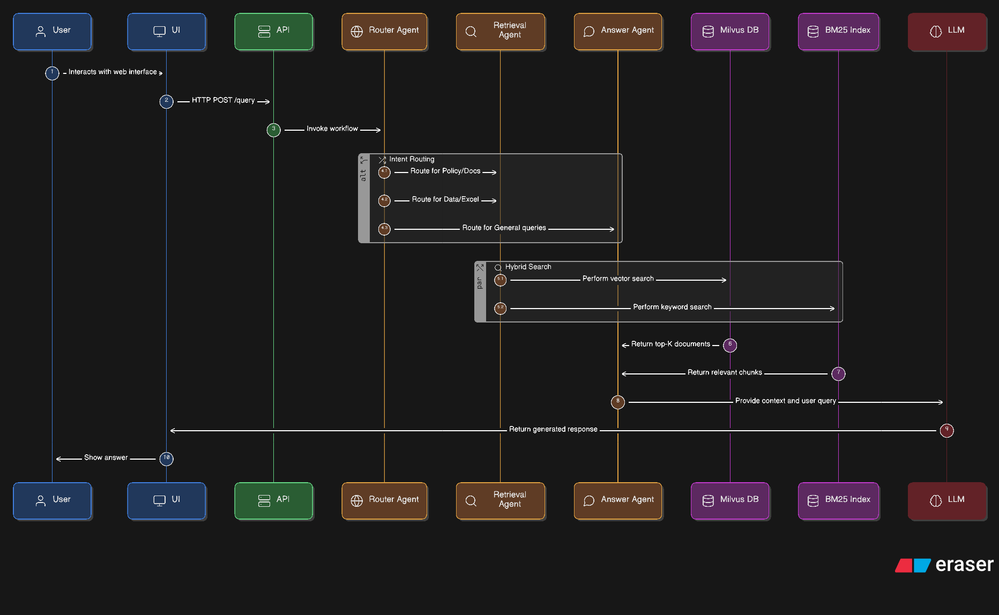

# 🤖 Agentic RAG Customer Support System

A high-performance, privacy-focused **Agentic RAG (Retrieval-Augmented Generation)** system designed for intelligent customer support. This project utilizes a multi-agent architecture orchestrated by **LangGraph** to process complex user queries, routing them efficiently between vector search (PDFs) and structured data lookups (Excel).

---


## 🏗️ System Architecture


graph TD
    User[User] -->|Interacts| UI[Streamlit Frontend]
    UI -->|HTTP POST /query| API[FastAPI Backend]
    
    subgraph "LangGraph Workflow"
        API -->|Invoke| Router[Router Agent]
        
        Router -->|Intent: Policy/Docs| Retriever[Retrieval Agent]
        Router -->|Intent: Data/Excel| Retriever
        Router -->|Intent: General| Answer[Answer Agent]
        
        Retriever -->|Hybrid Search| Milvus[(Milvus DB)]
        Retriever -->|Keyword Search| BM25[(BM25 Index)]
        
        Milvus -->|Top-K Docs| Answer
        BM25 -->|Chunks| Answer
    end
    
    Answer -->|Context + Query| LLM["Ollama (Llama 3.2)"]
    LLM -->|Generated Response| UI
```



## 🚀 Tech Stack & Design Decisions

We carefully selected this technology stack to balance performance, scalability, and control.

### 1. **Orchestration: LangGraph**
*   **Why?** Unlike linear chains, **LangGraph** allows us to build stateful, cyclic workflows. This is crucial for our "Router Agent" which needs to make decisions (e.g., "Is this a refund question or a technical error code?") and potentially loop back or jump to different retrieval strategies dynamically.

### 2. **Vector Database: Milvus (Docker)**
*   **Why?** **Milvus** is an enterprise-grade, open-source vector database built for massive scale. We chose it over simple file-based stores (like Chroma/FAISS) because it supports **Hybrid Search** (combining dense vector embeddings with sparse keyword matching), ensuring higher retrieval accuracy for specific terms like "Error 505".

### 3. **LLM Inference: Ollama (Llama 3.2)**
*   **Why?** **Ollama** allows us to run powerful LLMs locally. We use **Llama 3.2 1B**, a lightweight yet capable model, ensuring **100% data privacy**, zero API costs, and the ability to run on standard hardware (even laptops with 4GB RAM).

### 4. **Backend API: FastAPI**
*   **Why?** **FastAPI** is the modern standard for Python APIs. It provides high performance (asynchronous), automatic Swagger documentation, and robust type validation (Pydantic), identifying it as the ideal bridge between our complex agent logic and the frontend.

### 5. **Frontend: Streamlit**
*   **Why?** **Streamlit** allows for rapid prototyping of data-centric web apps entirely in Python. It let us build a chat interface with file upload capabilities in minutes, focusing our effort on the AI logic rather than UI boilerplate.

### 6. **Retrieval: Hybrid Search (BM25 + Dense)**
*   **Why?** Pure vector search sometimes misses exact keyword / ID matches (like SKU numbers). By combining **Milvus (Dense)** with **BM25 (Sparse/Keyword)**, we get the "best of both worlds"—semantic understanding of concepts and exact matching of technical terms.

---

## 🛠️ Project Structure

The project is organized into logical modules for maintainability:

```text
app/
├── agents/       # The "Brain": Router, Retrieval, and Answer agents
├── workflow/     # The "Skeleton": LangGraph orchestration logic
├── api/          # The "Mouth": FastAPI backend server
├── frontend/     # The "Face": Streamlit user interface
└── ingestion/    # The "Stomach": Data processing & loading scripts
```

---

## ⚡ Setup & Installation

### Prerequisites
1.  **Docker Desktop** (Required for Milvus).
2.  **Ollama** (Install from [ollama.com](https://ollama.com)).
3.  **Python 3.10+**.

### Step 1: Install Models
Run these commands in your terminal to download the necessary local models:
```powershell
ollama pull llama3.2:1b
ollama pull nomic-embed-text
```

### Step 2: Start Database
Launch the Milvus vector database using Docker:
```powershell
docker-compose up -d
```

### Step 3: Install Dependencies
```powershell
pip install -r requirements.txt
```

---

## 🖥️ How to Run

You need to run the Backend and Frontend in separate terminals.

**Terminal 1: Start Backend API**
```powershell
python -m app.api.server
```
*Wait for "Application startup complete".*

**Terminal 2: Start Frontend UI**
```powershell
streamlit run app/frontend/app.py
```
*Your browser will auto-open to `http://localhost:8501`.*

---

## 📖 Usage Guide

1.  **Upload Data**: Use the sidebar to upload **PDFs** (Policy docs) or **Excel files** (Error codes, Product data).
2.  **Ingest**: Click the "Ingest Files" button. This processes the data into Milvus.
3.  **Chat**: Ask questions!
    *   *"What is the refund policy?"* → Routes to Vector Search.
    *   *"Lookup error code E-505"* → Routes to Excel Data.
    *   *"Hello"* → handled by General Chat.


---
*Built with ❤️ using Agentic AI.*
