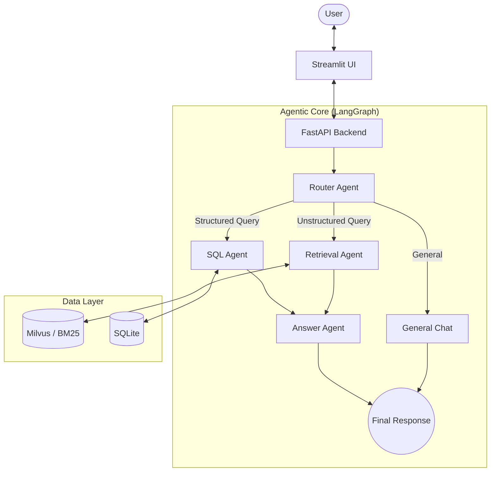

# System Design & Architecture

## 1. System Architecture Diagram

## 2. Agentic Workflow Design

The system employs a **Router-Based Agentic Workflow** implemented using `LangGraph`. This design ensures that each user query is handled by the most specialized component.

1.  **Input Processing**: The `Router Agent` analyzes the intention of the query.
2.  **Routing Decision**:
    *   **RAG Route**: For questions about policies, manuals, or troubleshooting (e.g., "Amber light meaning"), the system routes to the `Retrieval Agent`.
    *   **SQL Route**: For quantitative questions (e.g., "How many error codes?"), the system routes to the `SQL Agent`.
    *   **Chat Route**: For greetings or out-of-scope banter, it routes to `General Chat`.
3.  **Generation**: The focused context (documents or SQL results) is passed to the `Answer Agent`, which synthesizes the final natural language response.

## 3. Context Construction Strategy

Context is built dynamically based on the route:

*   **Hybrid Search (RAG)**: We use an `EnsembleRetriever` combining:
    *   **Dense Retrieval (Milvus)**: Uses `nomic-embed-text` embeddings to find semantic matches.
    *   **Sparse Retrieval (BM25)**: Uses keyword matching to ensure exact terms (like specific error codes "E4") are not lost.
    *   **Strategy**: Top 5 results from both are weighed (50/50) and de-duplicated to form a comprehensive context window.
*   **Structured Context (SQL)**:
    *   The SQL Agent inspects the schema of `orders.db`, generates a valid SQL query, executes it, and returns the raw results (rows) as context.

## 4. Technology Choices and Rationale

| Component | Choice | Rationale |
| :--- | :--- | :--- |
| **Orchestration** | **LangGraph** | Provides stateful, cyclic control flow needed for multi-step agent reasoning, superior to linear chains. |
| **LLM** | **Ollama** | Runs locally (privacy-focused) with no API costs. Capable of JSON output for routing. |
| **Vector DB** | **Milvus** | Enterprise-grade, scalable vector database running via Docker. Supports advanced indexing. |
| **Backend** | **FastAPI** | High-performance, async Python web framework. Ideal for serving the agent graph. |
| **Frontend** | **Streamlit** | Rapid development of interactive data apps. allowed for quick iteration of the chat interface. |
| **Hybrid Search** | **BM25 + Milvus** | Pure vector search often misses exact keywords (like "E4"). Hybrid search solves this. |

## 5. Key Design Decisions

*   **Separation of Concerns**: Splitting "Retrieval" and "Answering" into separate nodes allows us to debug retrieval quality independently of generation quality (as seen in our debugging of the "Amber Light" issue).
*   **Dockerized Infrastructure**: Milvus and Etcd are containerized to ensure consistent environments and easy setup/teardown.
*   **Fallback Handling**: If the Router fails or throws an exception, the system defaults to "General Chat" to prevent crashing.

## 6. Limitations

*   **Ingestion Fragility**: Currently, if one file in the batch is corrupt (e.g., a bad PDF), the entire ingestion process can halt if not explicitly handled (Fixed in v1.1).
*   **Local Resource Usage**: Running Ollama and Milvus locally requires significant RAM and CPU/GPU resources, which may impact performance on lower-end machines.
*   **Stateless API**: While the Frontend maintains session history, the Backend API is currently stateless per request. Multi-turn conversation capability is limited to the client-side context.
